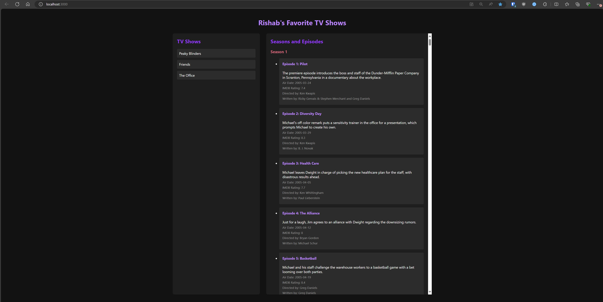
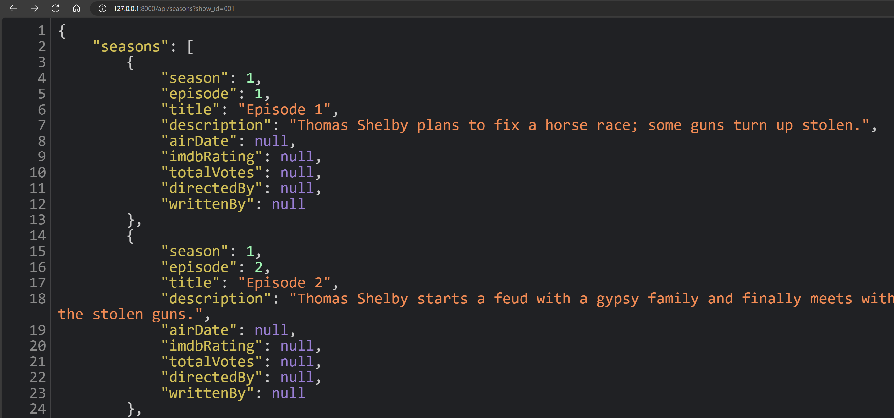

# LTC DevOps Project

This is the sample application for the DevOps Capstone Project on [Learn to Cloud.](https://learntocloud.guide)

## Application

**Front-End** - A web application where users can view.

**API**: API that receives request to fetch TV Shows or Movies data, stored in NoSQL Database.

## Running locally

### API

The API code exists in the `api` directory. You can run the API server locally:

- Clone this repo
- Make sure you are in the `api` directory
- Create a virtualenv by typing in the following command: `python -m venv .venv`
- Install the required packages: `pip install -r requirements.txt`
- Create a `.env` file, and add your CosmosDB connection details(only if you are using Azure CosmosDB), check  `.env.example`
- Also, change the API code depending on the data stored in your NoSQL Database in `main.py` accordingly
- Run the API server: `uvicorn main:app --reload`
- Your API Server should be running on port `http://localhost:8000`

### DB

The DB is a Azure CosmoDB.
Create one using COSMODB interface and identification informations in a .env file in the api folder
CosmosDBEndpoint="your endpoint"
CosmosDBKey="your cosmos db key"

### Front-end

The front-end code exits in the `frontend` directory. You can run the front-end server locally:

- Clone this repo
- Make sure you are in the `frontend` directory
- Install the dependencies: `npm install`
- Run the NextJS Server: `npm start`
- Your Front-end Server should be running on `http://localhost:3000`

## Goal

The goal is to get hands-on with DevOps practices like Containerization, CICD and monitoring.

- Containerize the Application: Create Dockerfiles for both api and frontend.
- CI/CD: Setup CI/CD pipeline to push images to Dockerhub or other container registries like [ACR](https://azure.microsoft.com/en-us/products/container-registry) or [ECR](https://aws.amazon.com/ecr/).
- Infrastructure as Code: Deploy a Kubernetes cluster to your choice of cloud provider, using Terraform.
- Kubernetes: Create deployments for both of your containers using YAML files, and deploy it to your cluster.
- Monitoring: Setup monitoring for your cluster, look into Prometheus and Grafana.

### Azure deployment
Install azure CLI on your platform
First you will probably have to login `az login --tenant TENANT ID`
To deploy the infrastructure on azure, simply use `terraform init` and `terraform deploy`
To access the K8 cluster first use : `az aks get-credentials --resource-group ltcDevOpsRG --name K8S_cluster_ltc` to get credentials

## Monitoring

To access prometheus and grafana, because they are using only a Cluster IP, use a `kubectl port forward` for access.
It's possible the use public IP but it's not tested (bcs of azure free tier 3 publics IPs limit)